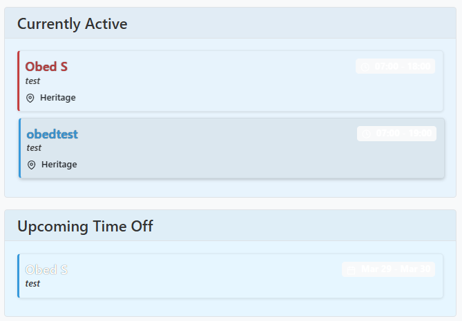
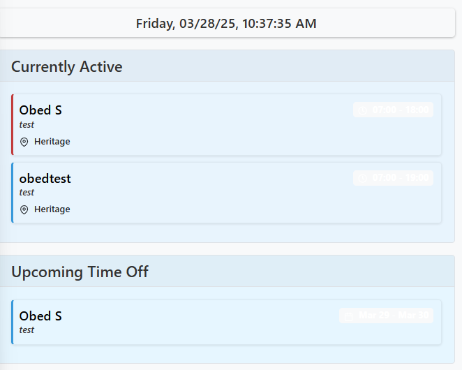
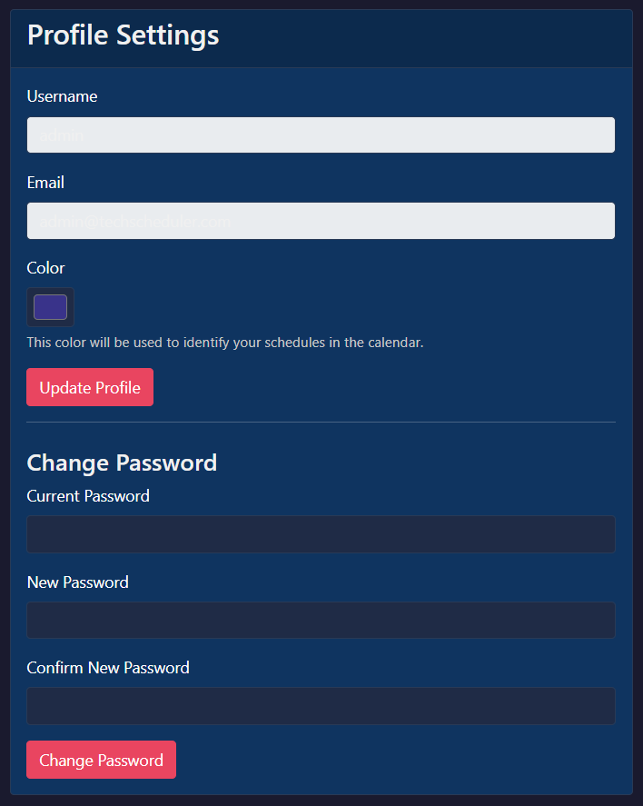

# Technician Scheduler - Administrator Guide

*Last Updated: March 28, 2025*

This guide focuses on administrator-specific functions and responsibilities in the Technician Scheduler system.

## Contents
1. [Administrator Access](#administrator-access)
2. [Admin Dashboard](#admin-dashboard)
3. [User Management](#user-management)
4. [Location Management](#location-management)
5. [Ticket Category Management](#ticket-category-management)
6. [Email Configuration](#email-configuration)
7. [System Backup & Restore](#system-backup--restore)
8. [Quick Links Management](#quick-links-management)
9. [Data Management Best Practices](#data-management-best-practices)
10. [Troubleshooting Common Issues](#troubleshooting-common-issues)

## Administrator Access

### Setting Administrator Privileges

Only existing administrators can grant admin privileges to other users:

1. Navigate to Admin > User Management.
2. Edit the user you want to make an administrator.
3. Check the "Is Admin" checkbox.
4. Save the changes.

### Admin Navigation

After logging in as an administrator, you'll see an "Admin" option in the navigation sidebar, providing access to all administrative functions.

## Admin Dashboard

The Admin Dashboard provides:

1. System statistics:
   - Total number of users, locations, and schedules
   - Active vs. inactive locations
   - Open vs. closed tickets
   - System uptime and usage

2. Quick access to all administrative functions:
   - User Management
   - Location Management 
   - Ticket Categories
   - Email Settings
   - Backup & Restore
   - Quick Links Management

## User Management

The User Management section allows you to create, edit, and manage all user accounts.

### Creating Users

1. Click "Create User" in the User Management section.
2. Fill in the following information:
   - **Username**: Display name for the user
   - **Email**: User's email address (must be unique)
     - Email addresses are stored case-insensitively, so "user@example.com" and "User@Example.com" are treated as the same email.
   - **Password**: Initial password (the user can change this later)
   - **Color**: Assign a color for this user's calendar entries
   - **Administrator**: Check if the user should have admin privileges
   - **Timezone**: Set the user's local timezone

3. Click "Create User" to add the account.
4. The system will not automatically notify new users. You should communicate their credentials separately.

### Editing Users

1. Click the "Edit" button next to a user's name.
2. Update any user details as needed.
3. To change a password, enter a new one in the password field.
4. If left blank, the password remains unchanged.
5. Click "Save Changes" to update the user's information.

### Deleting Users

Before deleting a user, consider these points:

1. Deletion will affect historical data related to the user.
2. If you only need to disable access, consider keeping the account but changing the password.
3. To delete a user:
   - Click the "Delete" button next to the user's name.
   - Confirm the deletion when prompted.

> **Important**: When a user is deleted, any tickets they created or were assigned to will be maintained for historical integrity. Their username in these records will be shown as "[Deleted User]".

## Location Management

Locations represent physical places where technicians are scheduled to work.

### Adding Locations

1. Click "Add Location" in the Location Management section.
2. Enter the following information:
   - **Name**: Location name (must be unique)
   - **Description**: Optional details about the location
   - **Active**: Whether the location is currently in use

3. Click "Add Location" to create it.

### Editing Locations

1. Click the "Edit" button next to a location name.
2. Update the name, description, or active status.
3. Click "Save Changes" to update.

### Deactivating Locations

Rather than deleting locations, it's better to deactivate them:

1. Edit the location.
2. Uncheck the "Active" checkbox.
3. Save changes.

Inactive locations:
- Won't appear in dropdown menus for new schedules
- Will still appear in historical data and reports
- Can be reactivated later if needed

## Ticket Category Management

Categories help organize and classify support tickets.

### Creating Categories

1. Click "Add Category" in the Ticket Categories section.
2. Enter the following information:
   - **Name**: Category name (must be unique)
   - **Description**: Details about what this category represents
   - **Default Priority**: The starting priority level for tickets in this category

3. Click "Add Category" to create it.

### Managing Categories

- **Edit**: Click the "Edit" button to update a category's name, description, or default priority.
- **Delete**: Only delete categories that have never been used. For obsolete categories that have tickets assigned, consider creating a new category and moving tickets to it.

## Email Configuration

Configure how and when the system sends email notifications.

### Basic Settings

1. Navigate to Admin > Email Settings.
2. Set the **Admin Email Group**: This email address receives all administrative notifications.
3. Configure notification triggers:
   - **New Schedules**: Notify when schedules are created
   - **Schedule Updates**: Notify when schedules are modified
   - **Schedule Deletions**: Notify when schedules are deleted

### Testing Email Configuration

1. After saving email settings, you can test the configuration:
2. Click "Test Email" if available, or
3. Create a test schedule to trigger a notification.
4. Check that the email is received correctly.

### Troubleshooting Email Issues

If emails are not being delivered:

1. Verify that the SendGrid API key is correctly set in the environment variables.
2. Check that the sender email (alerts@obedtv.com) is verified in SendGrid.
3. Review the SendGrid dashboard for any bounced or blocked emails.
4. Check system logs for any email sending errors.

## System Backup & Restore

Regular backups are essential for data safety. The system provides built-in backup and restore functionality.

### Creating Backups

1. Navigate to Admin > Backup & Restore.
2. Click "Create Backup".
3. The system will generate a JSON file containing all system data.
4. Click "Download Backup" to save the file to your computer.
5. Store backups securely in multiple locations.

### Automating Backups

For additional safety, set up automated backup scripts as described in the deployment guide:

1. Use the provided backup.sh script to create regular database dumps.
2. Schedule this script to run automatically using cron jobs.
3. Store automated backups in a secure location separate from the server.

### Restoring from Backup

> **Warning**: Restoring overwrites current data. Create a new backup before restoring.

1. Navigate to Admin > Backup & Restore.
2. In the Restore section, click "Choose File".
3. Select your backup file.
4. Click "Restore Backup".
5. Confirm the restoration when prompted.
6. The system will restore all data from the backup.
7. Verify that the restoration completed successfully by checking key data.

## Quick Links Management

Quick Links provide shortcuts to frequently used resources and can be customized for your organization.

### Adding Quick Links

1. Navigate to Admin > Quick Links.
2. Click "Add Quick Link".
3. Enter the following information:
   - **Title**: Display name for the link
   - **URL**: Full URL including https://
   - **Icon**: Name of a Feather icon (e.g., "link", "file", "tool")
   - **Category**: Grouping for the link
   - **Order**: Number to determine display order (lower numbers appear first)

4. Click "Add Link" to create it.

### Organizing Quick Links

1. Links are grouped by category.
2. Within each category, links are sorted by their order value.
3. To change the order, edit the link and update the order number.
4. Create consistent categories to organize links effectively.

## Data Management Best Practices

### Regular Maintenance Tasks

1. **Weekly**:
   - Review and archive closed tickets older than 30 days.
   - Check for unused or inactive locations and categories.
   - Verify that all email notifications are functioning correctly.

2. **Monthly**:
   - Create and download a full system backup.
   - Review user accounts for any that should be deactivated.
   - Check system logs for any recurring errors or issues.

3. **Quarterly**:
   - Perform database optimization (VACUUM ANALYZE on PostgreSQL).
   - Review and update Quick Links for relevance.
   - Test backup restoration in a separate environment.

### Archiving Old Tickets

To manage database growth and improve performance:

1. Navigate to Admin > Ticket Management (or Archive Tickets).
2. Set archiving criteria:
   - Only archive tickets with Closed or Resolved status.
   - Select a cutoff date (e.g., tickets closed more than 90 days ago).

3. Click "Preview" to see which tickets will be archived.
4. Review the list to ensure critical tickets aren't archived prematurely.
5. Click "Archive Selected Tickets" to move them to the archive.
6. Archived tickets remain accessible but don't appear in the main ticket view.

## Troubleshooting Common Issues

### User Access Problems

**Issue**: User cannot log in
**Solution**:
1. Verify the user's email address is correct in the system.
   - Remember that email addresses are case-insensitive (user@example.com and USER@example.com are treated as the same email).
2. Reset their password through the User Management interface.
3. Ensure the user is using the correct email/password combination (passwords remain case-sensitive).
4. Check browser cookie settings if persistent login issues occur.

### Schedule Display Issues

**Issue**: Schedules appear at incorrect times
**Solution**:
1. Verify that the user's timezone is set correctly in their profile.
2. Check that schedule start and end times are correct in the database.
3. Look for any browser caching issues by clearing cache or trying a different browser.

### Email Notification Failures

**Issue**: Email notifications aren't being delivered
**Solution**:
1. Check the SendGrid API key is correct in the environment variables.
2. Verify that the sending domain is verified in SendGrid.
3. Check email delivery logs in the SendGrid dashboard.
4. Ensure recipient email addresses are correct and not blocked.

### Database Performance Issues

**Issue**: System becomes slow over time
**Solution**:
1. Archive old tickets to reduce database size.
2. Perform database optimization with VACUUM ANALYZE.
3. Check server resources (CPU, memory, disk space).
4. Review database logs for slow queries and optimize if needed.

### Backup and Restore Errors

**Issue**: Backup or restore operations fail
**Solution**:
1. Check disk space availability.
2. Ensure the user has appropriate file permissions.
3. For restore failures, verify the backup file format is correct.
4. Check for any ongoing database transactions that might interfere.

---

For technical deployment and server configuration details, please refer to the Deployment Guide. For any issues not covered in this guide, please contact the development team for assistance.