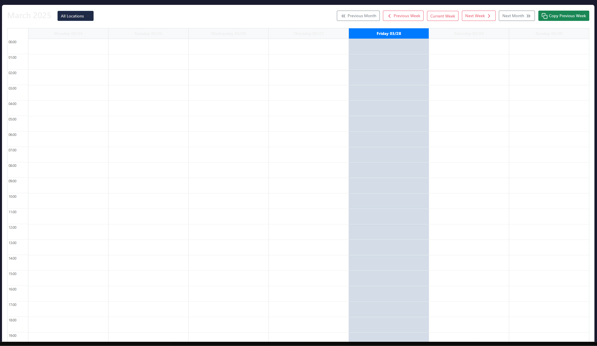

# Plex Engineering Technician Scheduler Quick Start Guide

*Last Updated: March 31, 2025*

This guide provides a quick overview of essential features for technicians using the Plex Engineering scheduling system on both desktop and mobile devices.

## Logging In

1. Navigate to the application URL in your web browser.
2. Enter your email and password.
   - Your email address is case-insensitive (e.g., tech@example.com or Tech@Example.com will work the same).
   - Your password remains case-sensitive, so enter it exactly as provided.
3. Click "Login".

## Setting Your Timezone

### On Desktop

For accurate schedule display:

1. Click your username in the sidebar.
2. Select "Profile".
3. Choose your timezone from the dropdown.
4. Click "Save Changes".

### On Mobile

1. Tap the hamburger menu (☰) in the top-left corner.
2. Tap your username.
3. Tap "Change Timezone".
4. Select your timezone.
5. Tap "Update Timezone".

## Understanding the Interface

### Desktop Calendar View

The main screen shows your weekly schedule and that of other technicians:

- Your schedule appears in your assigned color.
- Gray or distinctive colored blocks indicate time off.
- Currently active technicians are shown on the right side.
- Use Previous/Next Week buttons to navigate between weeks.

### Mobile Calendar View

The mobile interface provides a streamlined day-by-day view:

- Navigate using Previous/Next Day buttons.
- Your schedules appear with your assigned color as a left border.
- Time off appears with a dark red badge.
- Tap "Add Schedule" to create new entries.

### Theme Preference

#### On Desktop
- Click the sun/moon icon in the sidebar to switch between dark and light themes.

#### On Mobile
- Tap the sun/moon icon next to the hamburger menu to toggle themes.

## Managing Your Schedule

### Viewing Your Schedule (Desktop)

1. The calendar shows all technicians by default.
2. Click "Personal Schedule" to see only your assignments.
3. Your assignments are highlighted in your assigned color.
4. Hover over any schedule block to see details.

### Viewing Your Schedule (Mobile)

1. Navigate to the desired date using the day navigation buttons.
2. Your schedules will be listed for that day.
3. Tap any schedule to view or edit details.

### Time Off Requests (Desktop)

1. Click "New Schedule" above the calendar.
2. Select yourself as the technician.
3. Set start and end dates/times for your time off.
4. Check the "Time Off" checkbox.
5. Add a description (e.g., "Vacation", "Medical Leave").
6. Click "Save".

### Time Off Requests (Mobile)

1. Navigate to the desired day.
2. Tap "Add Schedule".
3. Select yourself as technician.
4. Set start and end times.
5. Check "Time Off".
6. Add a description.
7. Tap "Save".

## Ticket System

### Viewing Your Tickets (Desktop)

1. Click "Tickets" in the left sidebar.
2. By default, this shows all open tickets.
3. Filter to see only tickets assigned to you by selecting your name in the "Technician" filter.

### Viewing Your Tickets (Mobile)

1. Tap the hamburger menu (☰).
2. Tap "Tickets".
3. Use the "Assigned to Me" filter button to see your tickets.
4. Use the search box to find specific tickets.

### Working with Tickets

#### Viewing Ticket Details (Desktop)

Click on any ticket to view its full details, history, and comments.

#### Viewing Ticket Details (Mobile)

Tap on any ticket in the list to open its mobile-optimized detail view.

#### Adding Comments (Desktop)

1. Open a ticket.
2. Scroll to the comment section at the bottom.
3. Enter your comment.
4. Click "Add Comment".

#### Adding Comments (Mobile)

1. Open a ticket.
2. Scroll to the comment section.
3. Enter your comment in the mobile-optimized input area.
4. Tap "Add Comment".

#### Updating Ticket Status (Desktop)

1. Open a ticket.
2. Click "Update Status".
3. Select the new status:
   - **In Progress**: When you start working on the ticket
   - **Pending**: If waiting for something to proceed
   - **Resolved**: When the issue is fixed
   - **Closed**: When the ticket is completed and verified
4. Add a comment explaining the status change.
5. Click "Update Status".

#### Updating Ticket Status (Mobile)

1. Open a ticket.
2. Tap "Update Status".
3. Select the new status from the mobile-optimized menu.
4. Add a comment if needed.
5. Tap "Update".

#### Creating New Tickets (Mobile)

1. From the mobile ticket dashboard, tap "New Ticket".
2. Fill in the mobile-optimized form.
3. Tap "Create Ticket".

## Mobile-Specific Features

### Navigation

- The hamburger menu (☰) in the top-left provides access to all key features.
- Your username appears in the top navigation bar.
- The theme toggle is available in the top-right corner.

### Calendar Navigation

- Navigate by single days instead of a full week view.
- Use Today button to quickly jump to the current day.
- The day's date is clearly displayed at the top.

### Ticket Management

- Simplified filters with "Assigned to Me" and "Created by Me" buttons.
- Optimized ticket detail view with important information first.
- Large, touch-friendly action buttons for key tasks.

## Getting Help

If you encounter issues with the system:

1. Contact your administrator for immediate assistance.
2. Refer to the complete User Guide for detailed information.
3. On mobile, ensure your device has a supported browser version.

---

For detailed information on all features, refer to the complete User Guide.
© 2025 Plex Engineering