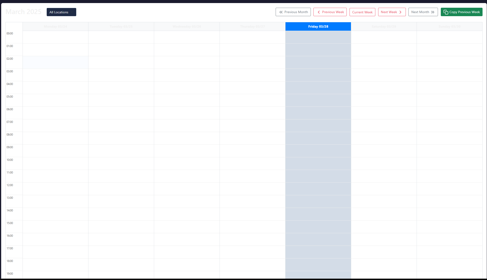
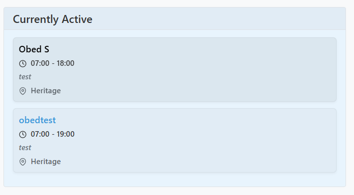

# Technician Scheduler Quick Start Guide

*Last Updated: March 28, 2025*

This guide provides a quick overview of essential features for technicians using the scheduling system.

## Logging In

1. Navigate to the application URL in your web browser.
2. Enter your email and password.
   - Your email address is case-insensitive (e.g., tech@example.com or Tech@Example.com will work the same).
   - Your password remains case-sensitive, so enter it exactly as provided.
3. Click "Login".

## Setting Your Timezone

For accurate schedule display:

1. Click your username in the top-right corner.
2. Select "Profile".
3. Choose your timezone from the dropdown.
4. Click "Save Changes".

## Understanding the Interface

### Calendar View

The main screen shows your weekly schedule and that of other technicians:

- Your schedule appears in your assigned color.
- Gray blocks indicate time off.
- Currently active technicians are shown on the right side.
- Use Previous/Next Week buttons to navigate between weeks.

### Theme Preference

- Click the sun/moon icon in the top navigation bar to switch between dark and light themes.

## Managing Your Schedule

### Viewing Your Schedule

1. The calendar shows all technicians by default.
2. Your assignments are highlighted in your assigned color.
3. Hover over any schedule block to see details.

### Time Off Requests

1. Click "New Schedule" above the calendar.
2. Select yourself as the technician.
3. Set start and end dates/times for your time off.
4. Check the "Time Off" checkbox.
5. Add a description (e.g., "Vacation", "Medical Leave").
6. Click "Save".

## Ticket System

### Viewing Your Tickets

1. Click "Tickets" in the left sidebar.
2. By default, this shows all open tickets.
3. Filter to see only tickets assigned to you by selecting your name in the "Technician" filter.

### Working with Tickets

#### Viewing Ticket Details

Click on any ticket to view its full details, history, and comments.

#### Adding Comments

1. Open a ticket.
2. Scroll to the comment section at the bottom.
3. Enter your comment.
4. Click "Add Comment".

#### Updating Ticket Status

1. Open a ticket.
2. Click "Update Status".
3. Select the new status:
   - **In Progress**: When you start working on the ticket
   - **Pending**: If waiting for something to proceed
   - **Resolved**: When the issue is fixed
   - **Closed**: When the ticket is completed and verified
4. Add a comment explaining the status change.
5. Click "Update Status".

## Getting Help

If you encounter issues with the system:

1. Contact your administrator for immediate assistance.
2. Refer to the complete User Guide for detailed information.
3. Check the Troubleshooting section in the full guide for common issues.

---

For detailed information on all features, refer to the complete User & Administrator Guide.