# Technician Scheduler - User & Administrator Guide

## Table of Contents
1. [Introduction](#introduction)
2. [Getting Started](#getting-started)
   - [Logging In](#logging-in)
   - [User Interface Overview](#user-interface-overview)
   - [Setting Your Timezone](#setting-your-timezone)
   - [Changing Theme Preference](#changing-theme-preference)
3. [Using the Calendar](#using-the-calendar)
   - [Viewing the Calendar](#viewing-the-calendar)
   - [Creating a Schedule](#creating-a-schedule)
   - [Editing a Schedule](#editing-a-schedule)
   - [Deleting a Schedule](#deleting-a-schedule)
   - [Viewing Available Technicians](#viewing-available-technicians)
   - [Setting Time Off](#setting-time-off)
4. [Ticket Management](#ticket-management)
   - [Viewing Tickets](#viewing-tickets)
   - [Creating a Ticket](#creating-a-ticket)
   - [Assigning a Ticket](#assigning-a-ticket)
   - [Adding Comments](#adding-comments)
   - [Changing Ticket Status](#changing-ticket-status)
   - [Filtering Tickets](#filtering-tickets)
   - [Viewing Archived Tickets](#viewing-archived-tickets)
5. [User Profile](#user-profile)
   - [Viewing Your Profile](#viewing-your-profile)
   - [Changing Your Password](#changing-your-password)
   - [Setting Your Preferences](#setting-your-preferences)
6. [Administrator Functions](#administrator-functions)
   - [Admin Dashboard](#admin-dashboard)
   - [User Management](#user-management)
   - [Location Management](#location-management)
   - [Ticket Category Management](#ticket-category-management)
   - [Email Settings](#email-settings)
   - [Backup and Restore](#backup-and-restore)
   - [Quick Links Management](#quick-links-management)
   - [Archiving Tickets](#archiving-tickets)
7. [Troubleshooting](#troubleshooting)
   - [Common Issues](#common-issues)
   - [Getting Help](#getting-help)

## Introduction

The Technician Scheduler is a comprehensive web application designed to help your organization manage technician schedules, track tasks, and streamline workflow. The system combines calendar scheduling with a ticketing system to provide a complete solution for managing technical resources.

**Key Features:**
- Intuitive calendar interface for scheduling technicians
- Ticketing system for tracking work items and issues
- Real-time view of currently active technicians
- Mobile-friendly responsive design
- Dark/Light theme options for user preference
- Email notifications for important events
- Administrative tools for system management

This guide provides detailed instructions for both regular users and administrators to effectively use all features of the application.

## Getting Started

### Logging In

1. Open your web browser and navigate to the application URL provided by your administrator.
2. You will be presented with the login screen:

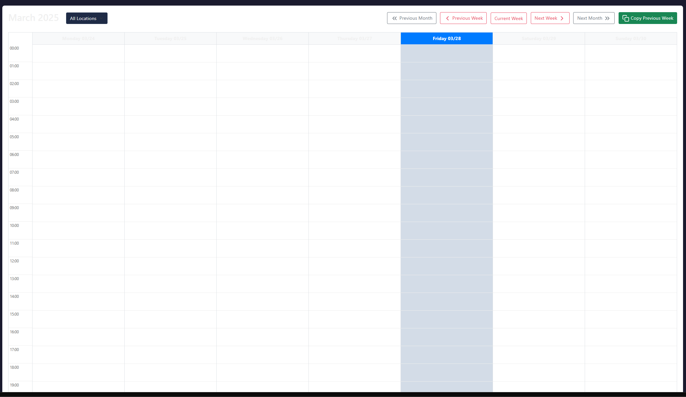

3. Enter your email address and password.
   - Note: Email addresses are case-insensitive, so "user@example.com" and "User@Example.com" will work the same.
   - Passwords remain case-sensitive for security.
4. Click the "Login" button.
5. If you've forgotten your password, contact your system administrator for assistance.

### User Interface Overview

After logging in, you'll see the main calendar view with the following components:

- **Navigation Sidebar**: Located on the left side, provides access to different sections of the application.
- **Currently Active Technicians**: Shows technicians who are currently on duty.
- **Calendar View**: Displays schedules in a weekly calendar format.
- **User Menu**: Located in the top-right corner, provides access to your profile and logout.
- **Theme Toggle**: Located in the top navigation bar, switches between dark and light themes.

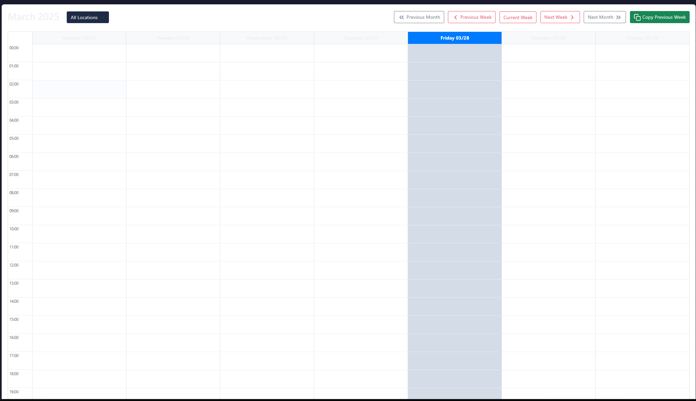

### Setting Your Timezone

Setting your correct timezone ensures that all schedules and times display correctly for your location:

1. Click on your username in the top-right corner of the screen.
2. Select "Profile" from the dropdown menu.
3. In the profile settings, find the timezone dropdown.
4. Select your appropriate timezone from the list.
5. Click "Save Changes" to update your timezone setting.

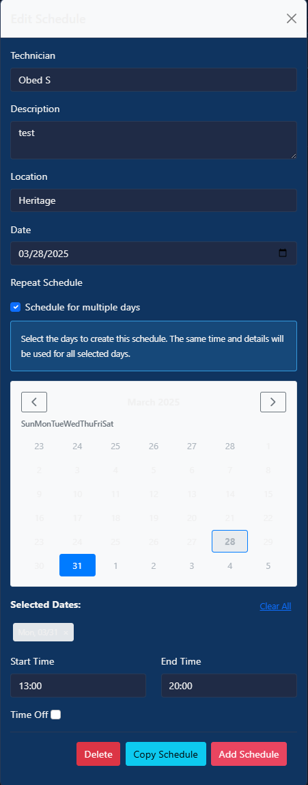

### Changing Theme Preference

The application supports both dark and light themes to suit your preference and lighting conditions:

1. Click the theme toggle button in the top navigation bar (sun/moon icon).
2. The interface will immediately switch to the alternative theme.
3. Your preference is automatically saved and will be remembered for future sessions.

Dark Theme:
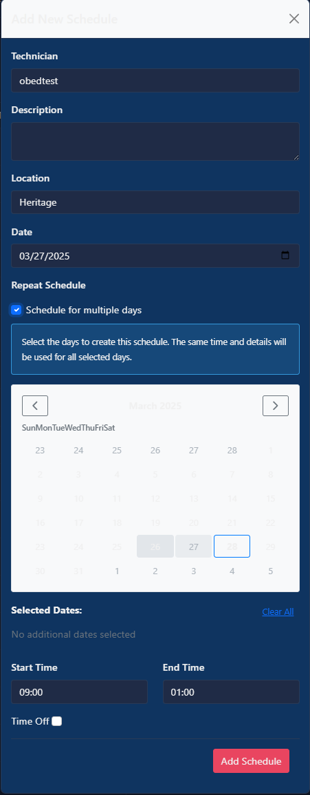

Light Theme:
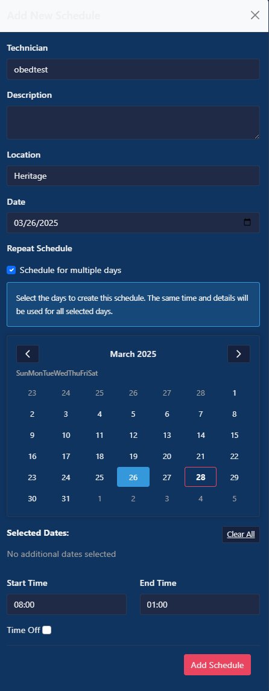

## Using the Calendar

### Viewing the Calendar

The calendar is the central feature for viewing and managing technician schedules:

1. The calendar view defaults to the current week.
2. Navigate between weeks using the "Previous Week" and "Next Week" buttons.
3. Each technician is displayed as a row in the calendar.
4. Time off is indicated with a different color (typically gray).
5. Regular schedules are displayed in the technician's assigned color.
6. Hover over any schedule to see additional details.

### Creating a Schedule

To create a new schedule for a technician:

1. Click the "New Schedule" button above the calendar.
2. In the form that appears, select the following:
   - **Technician**: Choose the technician from the dropdown.
   - **Start Time**: Set the date and time when the shift begins.
   - **End Time**: Set the date and time when the shift ends.
   - **Description**: Add optional details about the schedule.
   - **Location**: Select a location from the dropdown (if applicable).
   - **Time Off**: Check this box if this represents time off rather than a work shift.

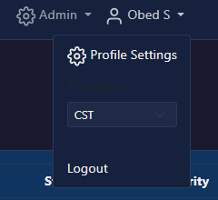

3. Click "Save" to create the schedule.
4. The new schedule will appear on the calendar immediately.

### Editing a Schedule

To modify an existing schedule:

1. Click directly on the schedule block in the calendar.
2. The edit form will open with the current schedule details.
3. Make your changes to any of the fields.
4. Click "Save" to update the schedule.

### Deleting a Schedule

To remove a schedule:

1. Click on the schedule block in the calendar to open the edit form.
2. Click the "Delete" button at the bottom of the form.
3. Confirm the deletion when prompted.
4. The schedule will be removed from the calendar.

### Viewing Available Technicians

The "Currently Active" section shows technicians who are currently on duty:

1. Look for the "Currently Active" panel on the right side of the calendar view.
2. Each active technician is displayed with their name and current location.
3. The technician's card is color-coded to match their assigned color.
4. This section updates automatically to reflect real-time availability.

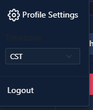

### Setting Time Off

To schedule time off for a technician:

1. Click the "New Schedule" button.
2. Fill in the form as you would for a regular schedule.
3. Check the "Time Off" checkbox.
4. Enter a description for the time off if needed (e.g., "Vacation," "Sick Leave").
5. Click "Save" to create the time off entry.
6. Time off will appear in the calendar with a distinct color and style.

## Ticket Management

### Viewing Tickets

The ticket dashboard displays all tickets in the system:

1. Click "Tickets" in the navigation sidebar.
2. The ticket dashboard will load, showing a list of tickets.
3. By default, open tickets are shown first.
4. Each ticket displays its ID, title, status, priority, category, and assigned technician.

### Creating a Ticket

To create a new support or work ticket:

1. From the ticket dashboard, click the "Create Ticket" button.
2. Fill in the ticket details:
   - **Title**: A concise description of the issue or task.
   - **Description**: Detailed information about what needs to be done.
   - **Category**: Select the appropriate category from the dropdown.
   - **Priority**: Choose the urgency level (Low, Medium, High, Urgent).
   - **Assign To**: Optionally select a technician to assign the ticket to.
   - **Due Date**: Set a deadline if applicable.

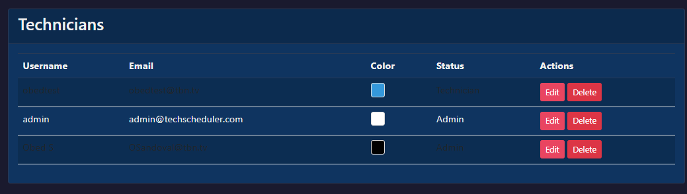

3. Click "Create Ticket" to submit.
4. The new ticket will appear in the ticket dashboard.

### Assigning a Ticket

To assign or reassign a ticket to a technician:

1. From the ticket dashboard, click on the ticket you want to assign.
2. In the ticket view, click the "Assign" button.
3. Select a technician from the dropdown list.
4. Add an optional note about the assignment.
5. Click "Assign Ticket" to complete the assignment.
6. The assigned technician will receive an email notification if email notifications are enabled.

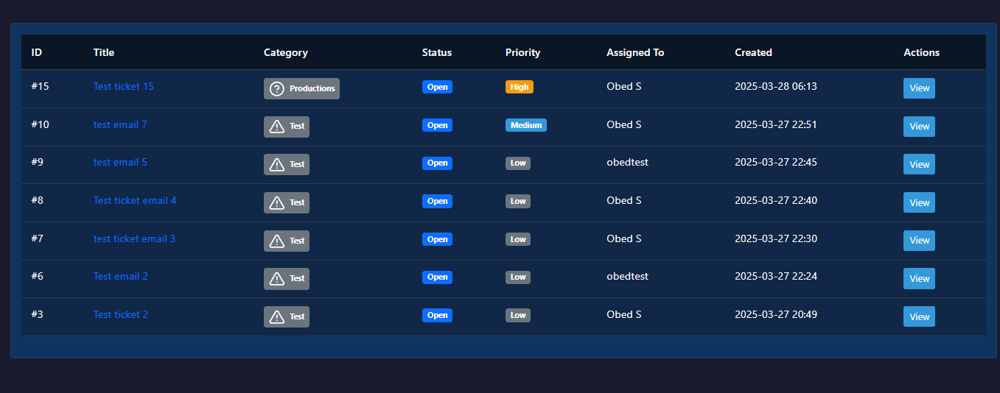

### Adding Comments

To add comments to a ticket:

1. Open the ticket by clicking on it in the dashboard.
2. Scroll down to the comment section.
3. Type your comment in the text box.
4. Click "Add Comment" to post.
5. Your comment will appear in the ticket history with a timestamp.
6. The ticket owner and assigned technician will receive email notifications about new comments if notifications are enabled.

### Changing Ticket Status

To update the status of a ticket:

1. Open the ticket by clicking on it in the dashboard.
2. Click the "Update Status" button.
3. Select the new status from the dropdown (Open, In Progress, Pending, Resolved, Closed).
4. Add an optional comment explaining the status change.
5. Click "Update Status" to save the changes.
6. The status change will be recorded in the ticket history.

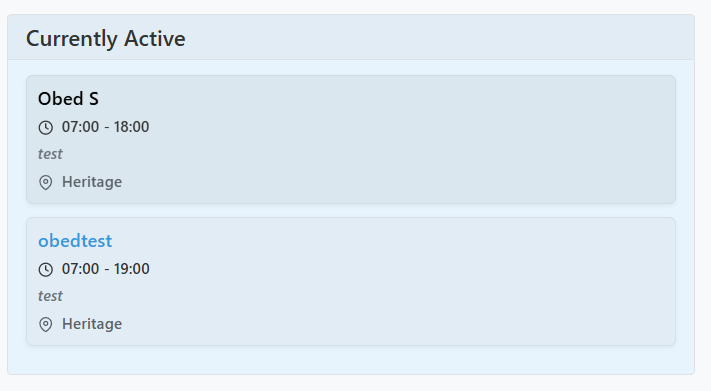

### Filtering Tickets

To filter the ticket list:

1. In the ticket dashboard, locate the filter controls above the ticket list.
2. Filter by:
   - **Status**: Select a specific status (Open, In Progress, etc.).
   - **Category**: Filter by ticket category.
   - **Priority**: Filter by urgency level.
   - **Technician**: Show tickets assigned to a specific technician.
3. The ticket list will update automatically as you apply filters.
4. Click "Clear Filters" to reset to the default view.

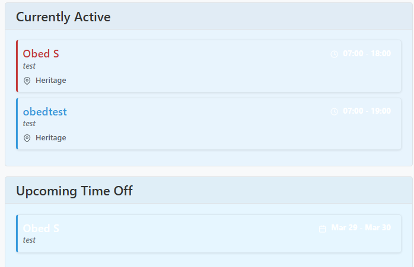

### Viewing Archived Tickets

Archived tickets are older tickets that have been moved out of the main view:

1. In the ticket dashboard, look for the "View Archived Tickets" link or button.
2. Click to access the archived tickets view.
3. Browse archived tickets using the same filtering options as the main dashboard.
4. To return to active tickets, click "Back to Active Tickets."

## User Profile

### Viewing Your Profile

To access and view your user profile:

1. Click on your username in the top-right corner of the screen.
2. Select "Profile" from the dropdown menu.
3. Your profile page will display your current information and settings.

### Changing Your Password

To update your password:

1. Navigate to your profile page.
2. Look for the "Change Password" section.
3. Enter your current password.
4. Enter and confirm your new password.
5. Click "Update Password" to save the changes.

### Setting Your Preferences

To adjust your user preferences:

1. Navigate to your profile page.
2. Update any of the following settings:
   - **Timezone**: Select your local timezone.
   - **Theme Preference**: Choose between dark and light themes.
   - **Color**: Select your personal color for calendar entries (admin may restrict this).
3. Click "Save Changes" to update your preferences.

## Administrator Functions

### Admin Dashboard

The Admin Dashboard provides access to all administrative functions:

1. Click "Admin" in the navigation sidebar (only visible to administrators).
2. The dashboard displays system statistics and administrative functions.
3. Use the links or buttons to access different administrative areas.

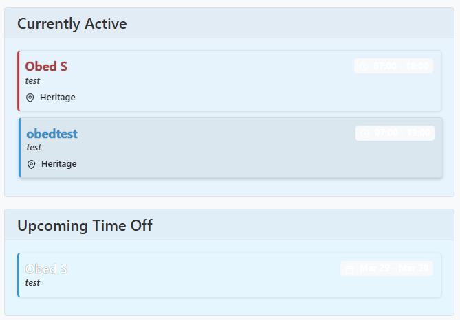

### User Management

To manage users in the system:

1. From the Admin Dashboard, click "User Management."
2. View the list of all users in the system.
3. To create a new user:
   - Click "Create User."
   - Fill in the user details (username, email, password, etc.).
   - Email addresses are stored case-insensitively, so "user@example.com" and "User@Example.com" are treated as the same email address.
   - Set administrator privileges if needed.
   - Click "Create User" to add them to the system.
4. To edit a user:
   - Click the "Edit" button next to the user's name.
   - Update their information as needed.
   - Click "Save Changes."
5. To delete a user:
   - Click the "Delete" button next to the user's name.
   - Confirm the deletion when prompted.
   - Note that deletion may be restricted if the user has associated schedules or tickets.

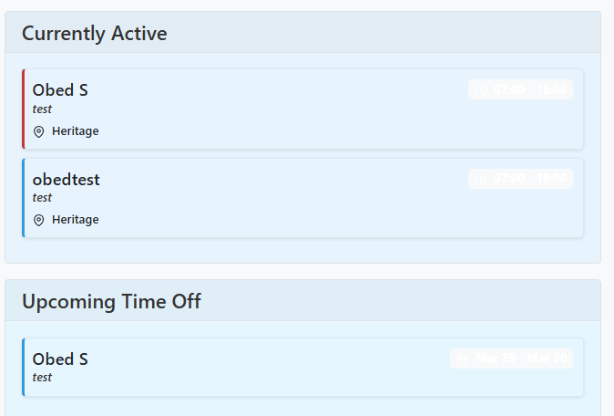

### Location Management

To manage locations in the system:

1. From the Admin Dashboard, click "Locations."
2. View the list of existing locations.
3. To add a new location:
   - Click "Add Location."
   - Enter the location name and description.
   - Set the active status.
   - Click "Add Location" to create.
4. To edit a location:
   - Click the "Edit" button next to the location name.
   - Update the information as needed.
   - Click "Save Changes."
5. To deactivate a location:
   - Either edit the location and uncheck the "Active" option, or
   - Click a dedicated "Deactivate" button if available.
   - Inactive locations won't appear in schedule dropdowns but remain in historical data.

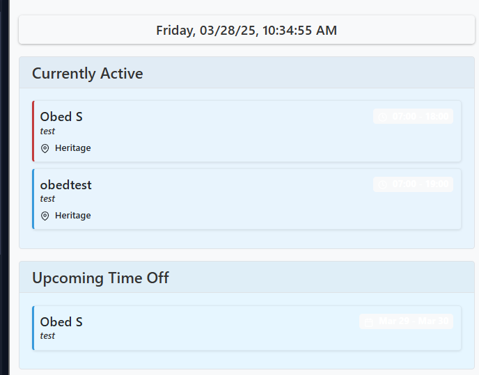

### Ticket Category Management

To manage ticket categories:

1. From the Admin Dashboard, click "Ticket Categories."
2. View the list of existing categories.
3. To add a new category:
   - Click "Add Category."
   - Enter the category name and description.
   - Set the default priority level.
   - Click "Add Category" to create.
4. To edit a category:
   - Click the "Edit" button next to the category name.
   - Update the information as needed.
   - Click "Save Changes."
5. To delete a category:
   - Click the "Delete" button next to the category name.
   - Confirm the deletion when prompted.
   - Note that deletion may be restricted if tickets are assigned to the category.

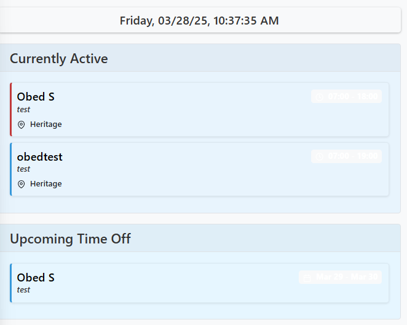

### Email Settings

To configure email notifications:

1. From the Admin Dashboard, click "Email Settings."
2. Update the following settings:
   - **Admin Email Group**: The email address that receives administrative notifications.
   - **Notification Settings**: Toggle which events should trigger email notifications:
     - New schedules
     - Schedule updates
     - Schedule deletions
     - Ticket assignments
     - Ticket comments
     - Ticket status changes
3. Click "Save Settings" to apply the changes.

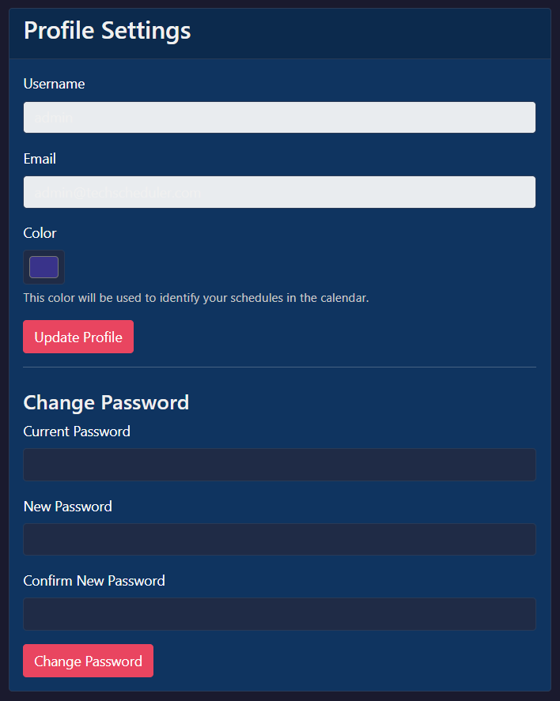

### Backup and Restore

To back up or restore system data:

1. From the Admin Dashboard, click "Backup & Restore."
2. To create a backup:
   - Click "Create Backup."
   - The system will generate a JSON file containing all system data.
   - Click "Download Backup" to save the file to your computer.
3. To restore from a backup:
   - Click "Choose File" in the restore section.
   - Select a previously downloaded backup file.
   - Click "Restore Backup" to begin the restoration process.
   - Confirm the restoration when prompted.
   - The system will restore all data from the backup file.

> **Warning**: Restoring from a backup will overwrite existing data. Make sure to create a new backup before performing a restore operation.

### Quick Links Management

To manage quick links for easy access to resources:

1. From the Admin Dashboard, click "Quick Links."
2. View the list of existing quick links.
3. To add a new quick link:
   - Click "Add Quick Link."
   - Enter the title, URL, icon name, and category.
   - Set the display order if needed.
   - Click "Add Link" to create.
4. To edit a quick link:
   - Click the "Edit" button next to the link title.
   - Update the information as needed.
   - Click "Save Changes."
5. To delete a quick link:
   - Click the "Delete" button next to the link title.
   - Confirm the deletion when prompted.
6. To reorder quick links:
   - Use the drag-and-drop interface if available, or
   - Edit each link and update the order number.

### Archiving Tickets

To archive old tickets:

1. From the Admin Dashboard, click "Ticket Management" or "Archive Tickets."
2. Set the criteria for archiving:
   - Status (typically, only Closed or Resolved tickets should be archived)
   - Age (tickets older than a certain date)
3. Click "Preview Archiving" to see which tickets will be affected.
4. Review the list to ensure no tickets are archived incorrectly.
5. Click "Archive Tickets" to move them to the archive.
6. Archived tickets remain in the database but are hidden from the main ticket view.

## Troubleshooting

### Common Issues

**Login Problems:**
- If you cannot log in, check that you're using the correct email address and password.
- Ensure that caps lock is not enabled when typing your password.
- If you've forgotten your password, contact your administrator for a reset.

**Calendar Display Issues:**
- If schedules are not displayed correctly, check that your timezone setting is correct.
- Try refreshing the page if the calendar appears to be out of date.
- Clear your browser cache if persistent display issues occur.

**Email Notification Problems:**
- If you're not receiving email notifications, check your spam folder.
- Verify that your email address is correct in your user profile.
- Ask an administrator to check the email notification settings.

**Performance Issues:**
- If the application is running slowly, try clearing your browser cache.
- Close other browser tabs and applications to free up system resources.
- Try using a different browser if issues persist.

### Getting Help

If you encounter issues not covered in this guide:

1. Contact your system administrator for assistance.
2. Provide detailed information about the problem, including:
   - The specific action you were attempting
   - Any error messages that appeared
   - Steps to reproduce the issue
   - Screenshots if possible
3. Your administrator may contact the development team for more complex issues.

---

This guide is maintained by the Technician Scheduler development team. Last updated: March 28, 2025.